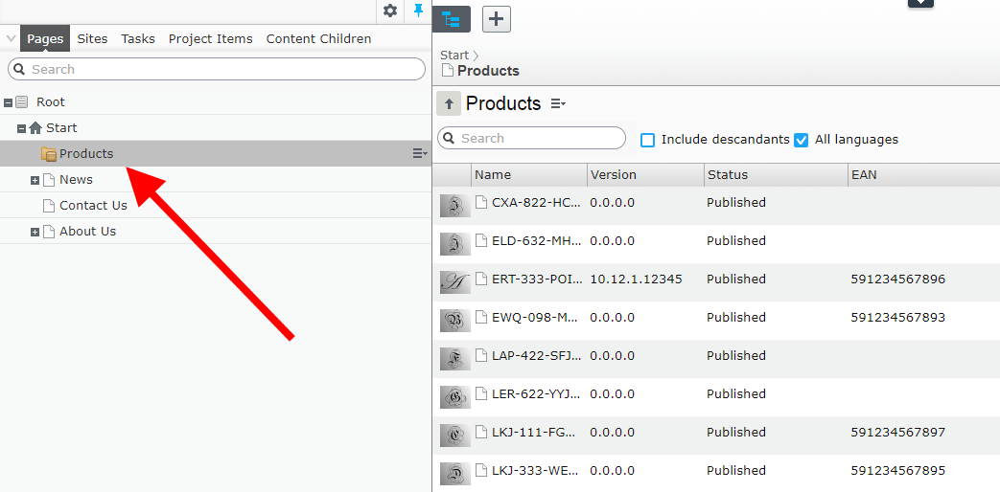
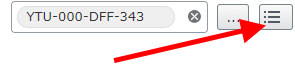
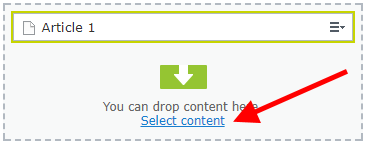

# Episerver Grid View

## Install

```Install-Package EPiServer.Labs.GridView```

Link to [nuget](https://nuget.episerver.com/package/?id=EPiServer.Labs.GridView) package.

Grid View is an addon that simplifies displaying filtered results and 
allow to show more information about the content in the columns.


## Configuring columns

Grid View allows to define what columns should be showed on the list. 
For example, editors with multilanguage sites would like to manage languages 
from the grid. For others, could be properties related with content publication 
like “Published By” and “Published On”. Also would be good to display 
properties specific to for the site like “Hero image” or “Short description”.
To help all editors I allow to configure the columns. You can show, both 
standard properties like “Name”, “Status”, “Include in menu” and any custom 
property added to the model.

Columns are configured on the server side. To simplify configuration 
code there is a builder class. The sample columns configuration looks like:

````
Columns = new ColumnsListBuilder()
    .WithContentName()
    .WithContentStatus()
    .WithContentTypeName()
    .WithVisibleInMenu()
    .WithCreatedBy()
    .WithPublishDate()
    .WithCurrentLanguageBranch()
    .WithEdit()
    .WithPreviewUrl()
    .WithActionMenu()
    .Build()
````

## Column renderers

The column is not just property value rendered as a text. There are set 
of cell renderers for displaying images, content references or dates. 
For example the image renderer displays thumbnail. After editor clicks on 
the thumbnail the popover with higher resolution and link to the image are displayed.


The list of built-in renderers is quite long. It inclides renderers like:

* Name – with name of the content, content icon and language information (same as in navigation tree)
* Status – localized content status
* Type – localized content type name
* Languages – displays list of all site languages
* Dates – formatted date
* Content Link – with editable and previewable versions

## Custom renderers

Developer can implement custom renderer. For example when ProductPage type 
has MajorVersion, MinorVersion, Relase Version, BuildVersion integer 
properties and we want to include this information on the grid.


We probably would like to show it as one column with dot separated values. In this example it wil be “10.7.1.234”.
With custom renderer it will be display like:


## Grid menu column

Grid View has context menu available next to current content name and in 
every row of children. Commands provider is shared between the View and main 
navigation. It means that view will display same actions as the tree. 
Even when you implement custom tree context menu action using the 
"[epi-cms/plugin-area/navigation-tree](https://world.episerver.com/documentation/developer-guides/CMS/user-interface/plug-in-areas/)"
 it will be showed in the view. 
For example you can add “Preview” command that opens selected page in View Mode.


## Working with languages

Working with languages in Grid View is similar to Navigation Tree. 
All translated versions and master versions for non-translated pages are 
displayed by default. When translation is missing, content name has italic font style.


To show only translated pages you can uncheck “All languages” filter. 
It’s the same filter as “Show content in current language only” on the Navigation Tree.


Grid view has additional feature. There is a special column renderers for managing languages. For every cell it displays all languages available on the site. Missing translations are grayed out. Clicking on the flag will change the language context and page context.

## Configuring view for page type

For ProductsListPage container, which can contains only ProductPage types, 
we would like to show different columns, that for other pages in the system. 
It doable using Grid View, because columns are configured through the extended 
UIDescriptor (ExtendedUIDescriptor). For example there are two UIDescriptors, 
one for SitePageData (the base class for all pages in the solution) and one 
for ProductsListPages container type.


For SitePageData we show general information:


But for Products we show thumbnail, version and and categories:


## Navigation tree with locked nodes

For nodes with large number of children expanding child nodes can be turned off. 
Those nodes will be showed with a different icon.



It can be done through web.config where I added ContentContainers setting. 
Setting stores coma separated list of ContentReferences that should be displayed as 
Container pages and have no expand button.


The Administrators can turn on and off nodes directly through the Edit Mode 
using “Manage Containers” button manage locked nodes. Of course without 
ContentReferences added through web.config which are disabled globally. 
For them it’s not possible to turn off containers through the UI.


For other pages, command is enabled.


It’s a toggle button. When page is not a container, after clicking the button, 
it will become a container. When page was a container, after clicking the button, 
page won’t be a container anymore.


## Grid View as MainNavigation Component

Custom view give the overview of the children, but it could be useful to 
locate the content and using D&D add it to the ContentArea. For this reason 
Grid View can be registered in the navigation pane.


Columns are also configurable, so you can extend the pane to have more information about the content.


You can use search to filter the list and D&D items to ContentReference properties.


You can also edit the page, filter the list and get back to edited page context.


## Grid View with link properties

Selecting content using “Select content” dialog is quite hard when container has more than 30 items.


There are versions for ContentReference, ContentArea and ContentReference list properties. 
They can be used by adding “GridView” UIHint:

* ContentReference



* ContentArea



* ContentReference list


Properties have additional button for selecting content using Grid view. Clicking the button will show the dialog with Gri View.


Of course there is a support for “Allowed types” and multiselect to ContentArea and ContentReference list.
Below is a demo of adding item to ContentReference property:


You can define starting point for properties. For example for “Featured Articles” 
we would like to show the dialog with “News” container while for “Product links” 
property from the “Products” container.


## Assets pane folder command

There is new "Show grid" command that allows to show grid view for folders 
in Assets Pane. This functionality should help with listing large number 
of blocks in one folder.


