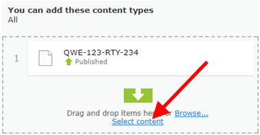

> For Content Manager docs, please visit [Content Manager](Readme.md)

# Episerver Grid View

## Install

```Install-Package EPiServer.Labs.GridView```

Link to [nuget](https://nuget.episerver.com/package/?id=EPiServer.Labs.GridView) package.

GridView package is an add-on that has several features:
* [GridView UI search component](#gridview-ui-search-component) - a powerful dgrid-based, fully configurable UI component that flattens the hierarchical structure and displays descendents of the currently selected content item.
* [GridView Main Navigation Component](#gridview-main-navigation-component) - instead of displaying the site in a hierarchical way the editor will be able to browse it as folders (a bit like Windows Explorer).
* [Enhanced Properties](#enhanced-properties) - enhanced ContentReference, ContentArea and LinkItemCollection properties - much more powerful way of finding the needed content items

## GridView UI search component

To enable Grid View for all content types, you can set `IsViewEnabled` of
[GridViewOptions](#gridviewoptions) to true (by default it's false).

But recommended way is to enable custom view only for specific page types. In order to add the UI search component you will just have to register it as a `SearchContentView` and provide a generic type parameter that defines which content types this new View will be applied to.
For example to add the Grid View to all instances of `StandardPage` you will have to add this code to your site:
```cs
[ServiceConfiguration(typeof(ViewConfiguration))]
public class ContainerGridView : SearchContentView<StandardPage>
{
}
```


### Configuring columns

It is possible to define which columns are shown in the grid.
For example, editors with multilanguage sites would like to manage languages from the grid. Others may want to see properties related with content publication like “Published By” and “Published On”. Also would be good to display properties specific to for the site like “Hero image” or “Short description”. 

You can show, both standard properties like “Name”, “Status”, “Include in menu” and any custom property added to the model.

Columns are configured on the server side. To simplify configuration 
code there is a builder class. 

The sample columns configuration for StandardPage looks like this:

```cs
[UIDescriptorRegistration]
public class StandardPageGridViewUIEditorDescriptor : ExtendedUIDescriptor<StandardPage>
{
    public SitePageDataUIEditorDescriptor()
        : base(ContentTypeCssClassNames.Page)
    {
        GridSettings = new GridSettings
        {
            Columns = new ColumnsListBuilder()
                .WithContentName()
                .WithContentStatus()
                .WithContentTypeName()
                .WithVisibleInMenu()
                .WithCreatedBy()
                .WithPublishDate()
                .WithCurrentLanguageBranch()
                .WithEdit()
                .WithPreviewUrl()
                .WithActionMenu()
                .Build()
        };
    }
}
````

### Column renderers

The column is not just property value rendered as a text. There are set 
of cell renderers for displaying images, content references or dates. 
For example the image renderer displays thumbnail. After editor clicks on 
the thumbnail the popover with higher resolution and link to the image are displayed.


The list of built-in renderers is quite long. It inclides renderers like:

* Name – with name of the content, content icon and language information (same as in navigation tree)
* Status – localized content status
* Type – localized content type name
* Languages – displays list of all site languages
* Dates – formatted date
* Content Link – with editable and previewable versions

### Custom renderers

Developer can implement custom renderer. For example when ProductPage type 
has MajorVersion, MinorVersion, Relase Version, BuildVersion integer 
properties and we want to include this information on the grid.


We probably would like to show it as one column with dot separated values. In this example it wil be “10.7.1.234”.
With custom renderer it will be display like:


Here you can find example about [how to create custom column renderer](GridView_CustomRenderer.md).

## Grid menu column

Grid View has context menu available next to current content name and in 
every row of children. Commands provider is shared between the View and main 
navigation. It means that view will display same actions as the tree. 
Even when you implement custom tree context menu action by the 
"[epi-cms/plugin-area/navigation-tree](https://world.episerver.com/documentation/developer-guides/CMS/user-interface/plug-in-areas/)"
 it will be showed in the view. 
For example you can add “Preview” command that opens selected page in View Mode.


## Working with languages

Working with languages in Grid View is similar to Navigation Tree. 
All translated versions and master versions for non-translated pages are 
displayed by default. When translation is missing, content name has italic font style.


To show only translated pages you can uncheck “All languages” filter. 
It’s the same filter as “Show content in current language only” on the Navigation Tree.


Grid view has additional feature. There is a special column renderers for managing languages. For every cell it displays all languages available on the site. Missing translations are grayed out. Clicking on the flag will change the language context and page context.

## Configuring view for page type

For ProductsListPage container, which can contains only ProductPage types, 
we would like to show different columns, that for other pages in the system. 
It doable using Grid View, because columns are configured through the extended 
UIDescriptor (ExtendedUIDescriptor). For example there are two UIDescriptors, 
one for SitePageData (the base class for all pages in the solution) and one 
for ProductsListPages container type.


For SitePageData we show general information:


But for Products we show thumbnail, version and and categories:


#### Set Grid View as a default view

To set Grid View as a default view for a page type, you can use `UIDescriptor`.
For example, to set Grid View as a default view for folder:

```cs
[UIDescriptorRegistration]
public class ContentFolderUIEditorDescriptor : ContentFolderUIDescriptor
{
    public ContentFolderUIEditorDescriptor()
    {
        DefaultView = SearchContentView.ViewKey;
    }
}
```

As you can see there is a constant for GridView folder name: `SearchContentView.ViewKey`.

## Navigation tree with locked nodes

For nodes with large number of children expanding child nodes can be turned off. 
Those nodes will be showed with a different icon.


It can be done through web.config where I added ContentContainers setting. 
Setting stores coma separated list of ContentReferences that should be displayed as 
Container pages and have no expand button.


The Administrators can turn on and off nodes directly through the Edit Mode 
by “Manage Containers” button manage locked nodes. Of course without 
ContentReferences added through web.config which are disabled globally. 
For them it’s not possible to turn off containers through the UI.


For other pages, command is enabled.


It’s a toggle button. When page is not a container, after clicking the button, 
it will become a container. When page was a container, after clicking the button, 
page won’t be a container anymore.


## GridView Main Navigation Component

Custom view give the overview of the children, but it could be useful to 
locate the content and using D&D add it to the ContentArea. For this reason 
Grid View can be registered in the navigation pane.


Columns are also configurable, so you can extend the pane to have more information about the content.


You can use search to filter the list and D&D items to ContentReference properties.


You can also edit the page, filter the list and get back to edited page context.


## Enhanced Properties

Selecting content by “Select content” dialog is quite hard when container has more than 30 items.


There are versions for ContentReference, ContentArea and ContentReference list properties. 
They can be used by adding “GridView” UIHint:

* ContentReference


* ContentArea


* ContentReference list



Properties have additional button for selecting content in Grid view. Clicking the button will show the dialog with Gri View.


Of course there is a support for “Allowed types” and multiselect to ContentArea and ContentReference list.
Below is a demo of adding item to ContentReference property:


You can define starting point for properties. For example for “Featured Articles” 
we would like to show the dialog with “News” container while for “Product links” 
property from the “Products” container.


## Assets pane folder command

There is new "Show grid" command that allows to show grid view for folders 
in Assets Pane. This functionality should help with listing large number 
of blocks in one folder.


## GridViewOptions

GridViewOptions is using Options class to configure some of the features.
Below is a description of Options properties.

| Property  | Type | Default | Description |
|---|---|---|---|
| IsComponentEnabled | bool | true | When true, then navigation component is enabled |
| IsViewEnabled | bool | true | When true, then custom view is enabled |
| ContentContainers | string | empty | Coma-separated list of ContentReferences for Content Containers under which the Navigation Tree should not display elements |
| ChildrenConvertCommandEnabled | bool | true | When true, then convert to children command is enabled |

Example that turns on GridView for all content types:
```cs
[ModuleDependency(typeof(InitializationModule))]
public class GridConfigurableModule : IConfigurableModule
{
    public void Initialize(InitializationEngine context)
    {
    }

    public void Uninitialize(InitializationEngine context)
    {
    }

    public void ConfigureContainer(ServiceConfigurationContext context)
    {
        context.Services.Configure<GridViewOptions>(config =>
        {
            config.IsViewEnabled = true;
        });
    }
}
```
