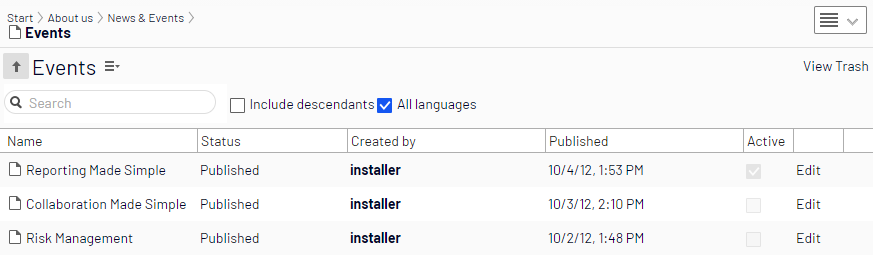
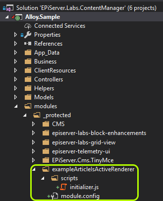

# Creating custom column renderer

This example shows how to implement a custom column renderer for Grid View.

Under the News List, we would like to show a Is Active checkbox column. The checkbox should be selected,
when the current date is between values of `ActiveFromDate` and `ActiveToDate` properties.



## Adding properties to model

First we need to define two properties on StandardPage model.

````
[SiteContentType(GUID = "9CCC8A41-5C8C-4BE0-8E73-520FF3DE8267")]
[SiteImageUrl(Global.StaticGraphicsFolderPath + "page-type-thumbnail-standard.png")]
public class StandardPage : SitePageData
{
    /*
        Other properties
    */

    [IncludeInQueryResult]
    [Display(Name = "From date", GroupName = SystemTabNames.Content, Order = 500)]
    public virtual DateTime ActiveFromDate { get; set; }

    [IncludeInQueryResult]
    [Display(Name = "To date", GroupName = SystemTabNames.Content, Order = 510)]
    public virtual DateTime ActiveToDate { get; set; }
}
````

Both new properties use `IncludeInQueryResult` attribute. 
This attribute is used to force the Grid View query to pass property values to the client.

## Enable Grid View for News List

To show Grid View under News List, we have to register ViewConfiguration for NewsPage.
There is no methods to be implemented. We just need to inherit from `SearchContentView`
and register service.

````
[ServiceConfiguration(typeof(ViewConfiguration))]
public class NewsListGridView : SearchContentView<NewsPage>
{
}
````

## Define columns list

Next step is to define a list of Grid View columns for the News List page type.

It is done by registering `UIDescriptorRegistration` for NewsList.

````
[UIDescriptorRegistration]
public class NewsListUIEditorDescriptor : ExtendedUIDescriptor<NewsPage>
{
    public NewsListUIEditorDescriptor()
    {
        GridSettings = new GridSettings
        {
            Columns = new ColumnsListBuilder()
                .WithContentName()
                .WithContentStatus()
                .WithCreatedBy()
                .WithPublishDate()
                .WithColumn("IsActive", "Active", "isPageActive", false, ColumnSizeCss.ColumnSize50)
                .WithEdit()
                .WithActionMenu()
                .Build()
        };
    }
}
````

As you can see, there is a `WithColumn` method with `IsActive` column name, and `isPageActive` as renderer.

## Definining custom renderer

The most difficult part is to define the custom column renderer. It is a DoJo module, that should
be registered as a "_protected" module.

We need to add two files module.config and initializer.js:



The module.config contains the following information:
* dependencies - should almost always be set to `episerver-labs-grid-view` when defining custom column renderers
* paths - responsible for creating URL to script. Usually you can use the name of the module folder
* initializer - path to the initializer file. Initializer file contains custom renderer code.

Below is the example of module.config file:

````
<?xml version="1.0" encoding="utf-8"?>
<module>
  <clientModule initializer="exampleArticleIsActiveRenderer.initializer">
    <moduleDependencies>
      <add dependency="episerver-labs-grid-view" type="RunAfter" />
    </moduleDependencies>
  </clientModule>

  <dojo>
      <paths>
          <add name="exampleArticleIsActiveRenderer" path="scripts" />
      </paths>
  </dojo>
</module>
````

New module has to be registered in web.config:

````
<protectedModules rootPath="~/EPiServer/">
    <!-- other modules definitions -->
	
    <add name="exampleArticleIsActiveRenderer" />
</protectedModules>
````

Now we have to add initializer implementation. It will register the new Grid View column renderer.

````
define([
    "dojo/_base/declare",
    "dijit/form/CheckBox",
    "epi/_Module",
    "episerver-labs-grid-view/gridColumnRenderers"
], function (
    declare,
    CheckBox,
    _Module,
    gridColumnRenderers
) {
    return declare([_Module], {
        initialize: function () {
            this.inherited(arguments);

            function isArticleActive(activeFromDate, activeToDate) {
                if (!activeFromDate) {
                    return false;
                }

                if (!activeToDate) {
                    return true;
                }

                var currentDate = new Date();

                activeFromDate = new Date(activeFromDate);
                activeToDate = new Date(activeToDate);

                if (currentDate > activeFromDate && currentDate < activeToDate) {
                    return true;
                }

                return false;
            }

            gridColumnRenderers.isPageActive = function (propertyName, customRendererSettings, grid) {
                return function (item, value, node, options) {
                    var activeFromDate = item.properties.activeFromDate;
                    var activeToDate = item.properties.activeToDate;
                    var isAvtive = isArticleActive(activeFromDate, activeToDate);

                    const container = document.createElement("div"); 
                    node.appendChild(container);

                    var checkbox = new CheckBox().placeAt(container);
                    checkbox.set("checked", isAvtive);
                    checkbox.set("readOnly", true);
                };
            };
        }
    });
});
````

By using the `episerver-labs-grid-view/gridColumnRenderers` dependency, we can add a new column renderer to the `gridColumnRenderers` module.
