# Episerver Content Manager

## Install

```Install-Package EPiServer.Labs.ContentManager```

Link to [nuget](https://nuget.episerver.com/package/?id=EPiServer.Labs.ContentManager) package.

## Introduction

Content Manager is an addon that allows to display flat list of content outside of Edit Mode.

It has two main parts:
* dashboard
* configurable views

## Dashboard

Dashboard gives users quick access to content. 
They can do a general full text search to find an item or edit content
through predefined categories on dashboard.

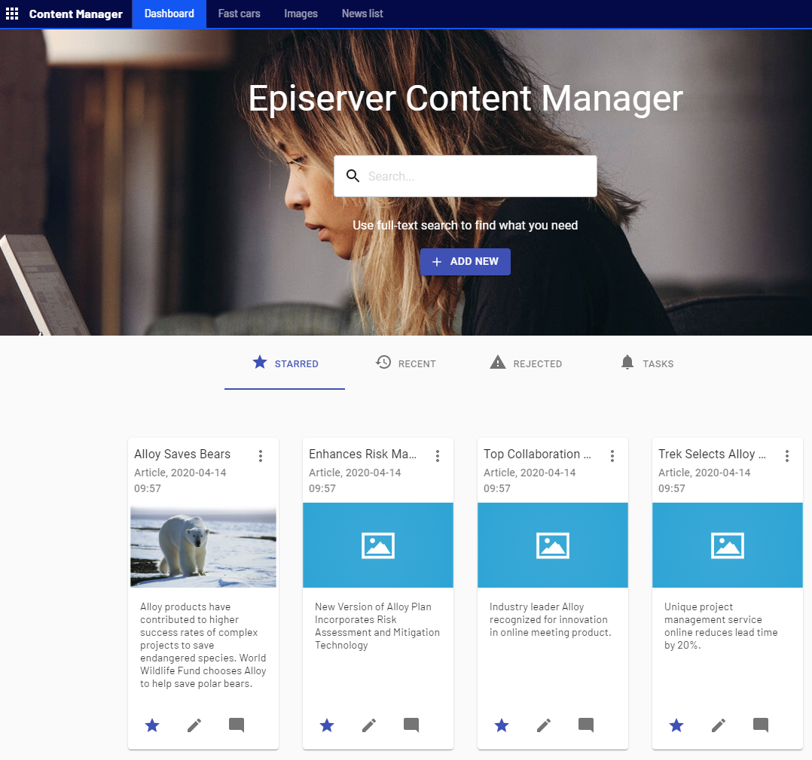

By default there are four tabs:
* **starred** - user favourite content
* **recent** - recently edited content
* **rejected** - content rejected by CMS Editor
* **tasks** - content with comments

### Configuring dashboard tabs

Tabs on dashboard are configurable. You can hide them or change their order.
To do that you need to configure `AvailableGadgets` option value:
```
AvailableGadgets => new[]

{
    ExternalDashboardGadgetType.Starred, 
    ExternalDashboardGadgetType.Rejected, 
    ExternalDashboardGadgetType.Tasks
};
```

In the example above, Starred items will be displayed at first position, then Rejected items
and then list of tasks.

### Using full text search

When using full text search, user automatically gets search suggestions.
Suggestion are enabled by default, but they can be turned off using options:

```
context.Services.Configure<ContentManagerOptions>((options) =>
{
    options.NotificationReceiversRoles = new[] { "WebEditors" };
    options.AutocompleteEnabled = false;
});
```

### Changing dashboard title

By default dashboard title is "Episerver Content Manager", 
but this value can be changed and localized using "`/contentmanager/dashboard/title`" resource key.

````
<?xml version="1.0" encoding="utf-8"?>
<languages>
  <language name="English" id="en">
    <contentmanager>
      <dashboard>
        <title>Alloy Fast cars Content Managment</title>
      </dashboard>
    </contentmanager>
  </language>
</languages>
````

## Views

View is a subpage inside Content Manager that displays filterable and sortable subset 
of contents from a site.

By default, when running Content Manager, Editor will see one view: **Root**. 
The default view will display all content available on site.

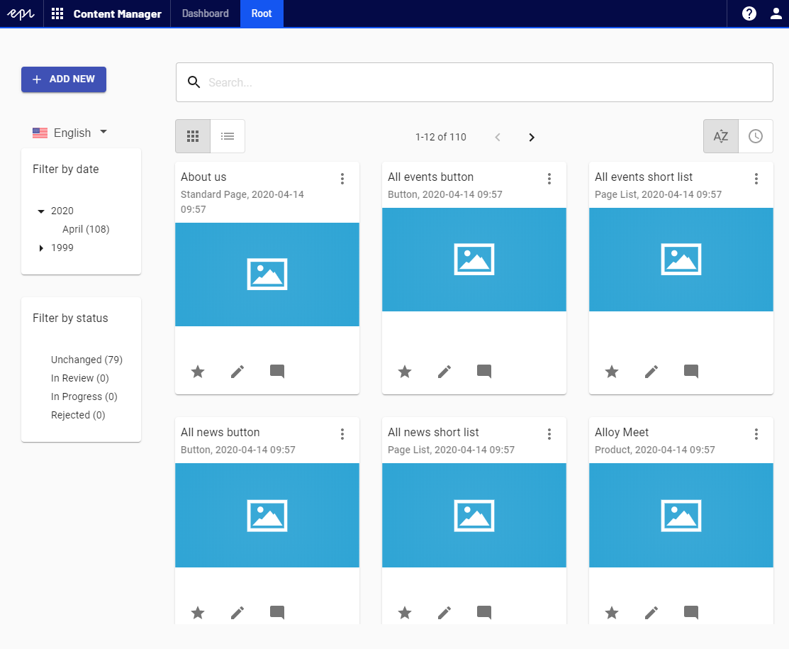

Custom view can be defined through code or using blocks.

#### Configuring views through code

To create view from code, you need to register new class that implements 
`IContentManagerViewConfiguration`.

| Property | Type | Description |
|---|---|---|
| Id | String | View identifier |
| ViewTitle | String | Title used as tab name |
| Root | ContentReference | Root for content list |
| SortOrder | int | Sort order in menu for view |
| NewContentRoot | ContentReference | Content link where new content will be added |
| AllowedTypesToAdd | IEnumerable&lt;Type&gt; | Types that editor can add when using external grid view |
| AllowedTypeIdentifiers | IEnumerable&lt;string&gt; | Type identifiers that editor can add when using external grid view |

To make implementation simpler, the class can inherit from `ContentManagerViewConfigurationBase`, 
that already implements `IContentManagerViewConfiguration` interface. 
Below is an example of view that displays cars blocks:

````
[ServiceConfiguration(typeof(IContentManagerViewConfiguration))]
public class CarsView : ContentManagerViewConfigurationBase
{
    public CarsView(UIDescriptorRegistry uiDescriptorRegistry) : base(uiDescriptorRegistry)
    {
        Id = "Cars";
        ViewTitle = "Cars";
        Root = GetCarsFolderRoot();
        AllowedTypesToAdd = new[] {typeof(CarBlock)};
    }

    private ContentReference GetCarsFolderRoot()
    {
        var children = ServiceLocator.Current.GetInstance<IContentLoader>()
            .GetChildren<IContent>(ContentReference.SiteBlockFolder);
        var carsFolder = children.FirstOrDefault(x => x.Name.ToLowerInvariant() == "cars")?.ContentLink ??
                         ContentReference.SiteBlockFolder;
        return carsFolder;
    }
}
````

#### Configuring views using blocks

It possible to configure custom views without deploying the code.
Editor has to add new block of type `CustomViewConfigurationBlock` 
under "CustomExternalViews" folder. Please note, that the folder has to be created manually 
by the Editor.

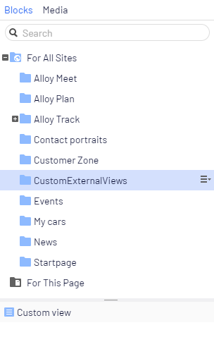

When editing block, Editor has to set:

| Property  | Required | Description |
|---|---|---|
| Root | true | Root page for content |
| SortOrder | int | Sort order in menu for view |
| Enabled | bool | When true, then view is used by views provider |
| New content root | false | Root for new content. When not set, then Root property will be used. |
| Allowed types to add | false | Content types displayed in view |

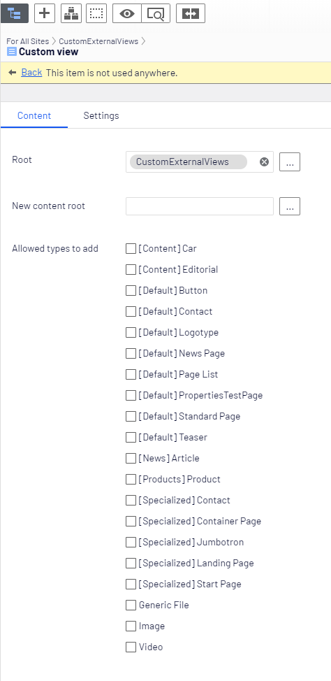

#### Custom views providers

Content Manager allows to register custom source of views. Those views will be concatenated with 
with built-in views. To do this you need to register class that implements `IExternalViewsProvider` interface.

Interface has only one method `GetViews`, that returns collection of view 
definition (`IContentManagerViewConfiguration`).

#### Localizing views

View title can be localized using resource files. The key in the resource file 
should be configured as `contentmanager/views/[view-id]/title`.

For example, for cars view, the view ID is "cars", and the XML resource will looks like:

````
<?xml version="1.0" encoding="utf-8"?>
<languages>
  <language name="English" id="en">
    <contentmanager>
      <views>
        <cars>
          <title>Fast cars</title>
        </cars>
      </views>
    </contentmanager>
  </language>
</languages>
````

#### Filtering views

Views can be filtered by:
 
1. Languages 

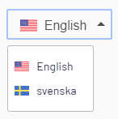

2. Date

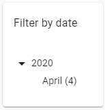

3. Status

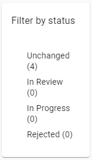


#### Media views

When all displayed types are media, then view is displayed as Media View.

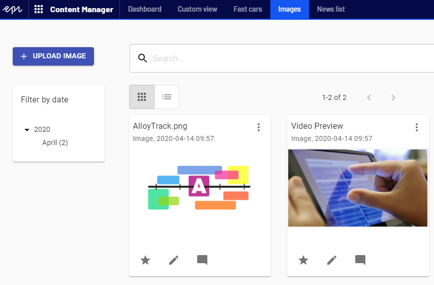

The difference between this view and regular view is that "Add new" 
content button was replaced with "Upload media" that allows to upload media directly.

## Cards

Items in Content Manager are displayed using cards.


Information on card are configurable. To change how item is displayed, 
the content model has to implement `IDashboardItem` that define card properties.
The interface has `SetItem` method called when item properties are set.

For example on ArticlePage:

````
[SiteContentType(
    GroupName = Global.GroupNames.News,
    GUID = "AEECADF2-3E89-4117-ADEB-F8D43565D2F4")]
[SiteImageUrl(Global.StaticGraphicsFolderPath + "page-type-thumbnail-article.png")]
public class ArticlePage : StandardPage, IDashboardItem
{
    public void SetItem(ItemModel itemModel)
    {
        itemModel.Description = MetaDescription;
        itemModel.Image = PageImage;
    }
}
````

When editing content, the build-in edit mode form is used

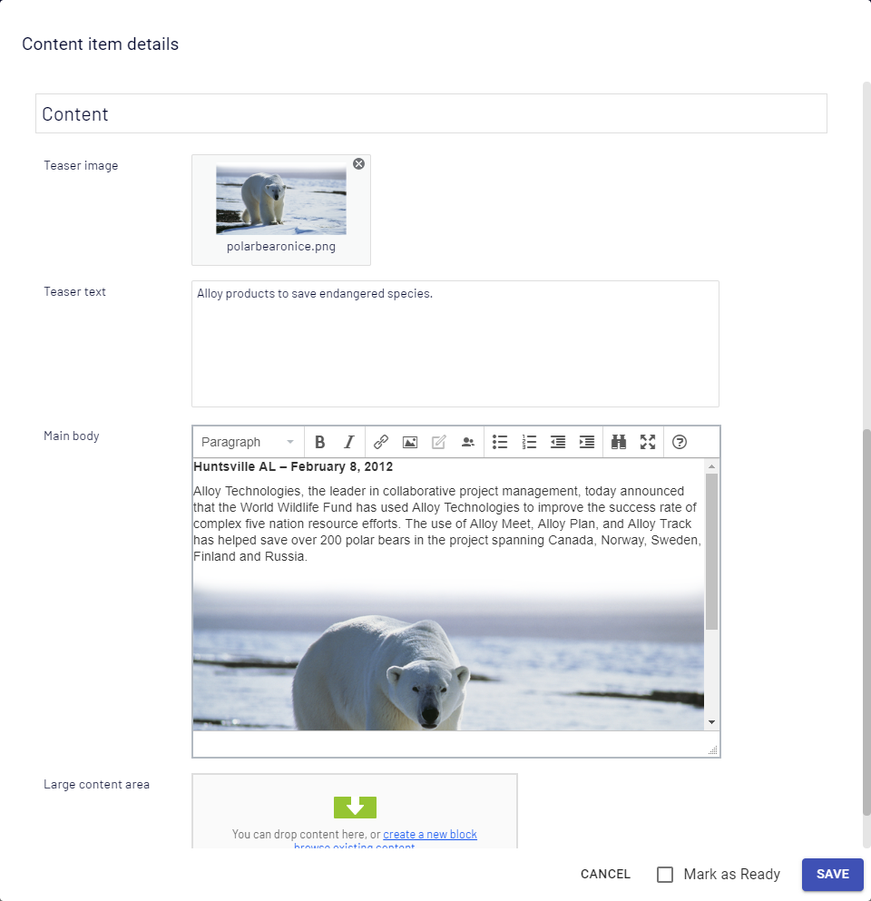

Editor can send content for review using "Mark as Ready" checkbox. 
When Content is marked as Ready for review it can't be edited.

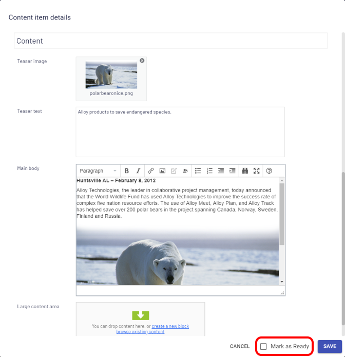

Editor can add comments to content. It will use same mechanism as Edit Mode 
content comments.

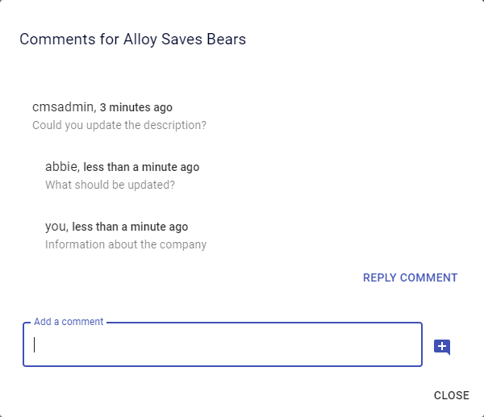


## Use custom styles

Content Manager allows to use custom CSS styles.

Custom styles can be configured using `module.config` file.
For example in Alloy module.config:

````
<?xml version="1.0" encoding="utf-8"?>
<module>
    <assemblies>
	    <!-- This adds the Alloy template assembly to the "default module" -->
        <add assembly="Alloy.Sample" />
    </assemblies>
    <clientResources>
        <!-- custom styles -->
        <add name="epi-cms.widgets.base" path="Styles/Styles.css" resourceType="Style"/>
    </clientResources>
    <dojo>
        <!-- Add a mapping from alloy to ~/ClientResources/Scripts to the dojo loader configuration -->
        <paths>
            <add name="alloy" path="Scripts" />
        </paths>
    </dojo>
</module>
````

View HTML root element has CSS class name that contains view name, so you can set styles based on that value.
For example for `Car` view:

````
.Cars.dashboard {
     background-color: blue;
}
````

## Using with Commerce

Content Manager can be used to list Episerver Commerce products.

To configure it, the `ExternalModules` should have Commrce added.
There is `EnsureCommerceLoaded` helper method that add required modules.

````
[ModuleDependency(typeof(EPiServer.Web.InitializationModule))]
public class ExternalGridInitialization : IInitializableModule
{
    public void Initialize(InitializationEngine context)
    {
        var contentOptions = ServiceLocator.Current.GetInstance<ContentManagerOptions>();
        contentOptions.EnsureCommerceLoaded();
    }

    public void Uninitialize(InitializationEngine context)
    {
    }

    public void Preload(string[] parameters)
    {
    }
}
````

## Content Manager options

Content Manager is using Options class to configure some of the features.
Below is a description of Options properties.

| Property  | Required | Default | Description |
|---|---|---|---|
| IsContentManagerEnabled | bool | true | When true, then Content Manager is enabled |
| IsBlocksProviderEnabled | bool | true | When true, then blocks views provider is enabled |
| AutocompleteEnabled | bool | true | When true, then autocomplete for searchbox is enabled |
| AvailableGadgets | IEnumerable<ExternalDashboardGadgetType> | null | List of tabs available on dashboard. When null then default tabs are configured |
| DefaultThumbnailUrl | string | null | URL to default card image thumbnail, used when content image is not provided. When null then default thumbnail is used |
| NotificationReceiversUsers | IEnumerable<string> | empty | List of users notified by Content Manager comments |
| NotificationReceiversRoles | IEnumerable<string> | empty | List of roles notified by Content Manager comments |
| CustomViewsFolderName | string | CustomExternalViews | Folder name used by blocks view provider |
| UrlPrefix | string | content | URL prefix added to Content Manager addon pages |
| ExternalModules | string | empty | External dojo modules initialized by Content Manager |
